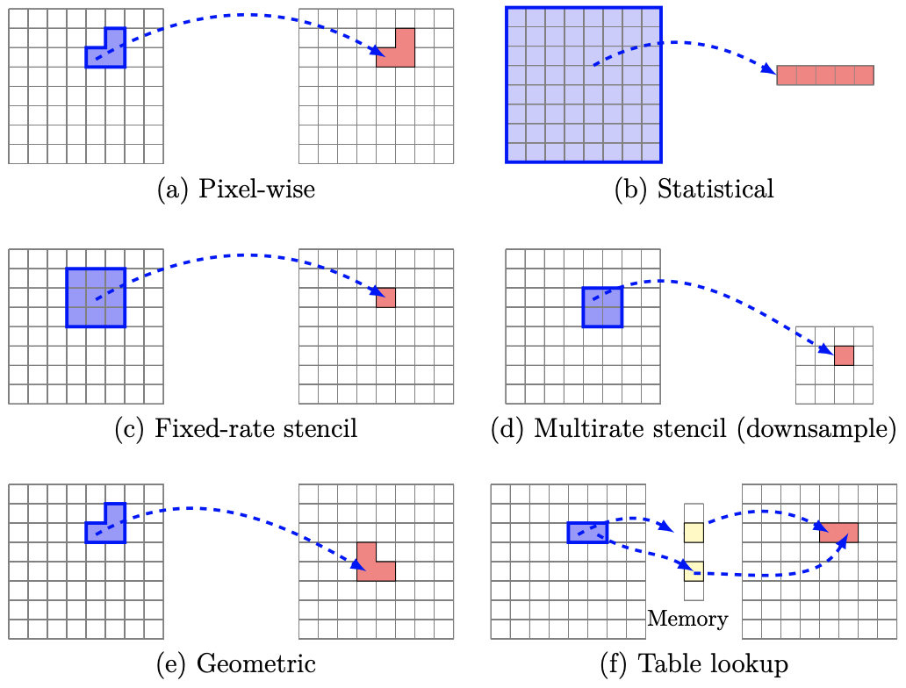
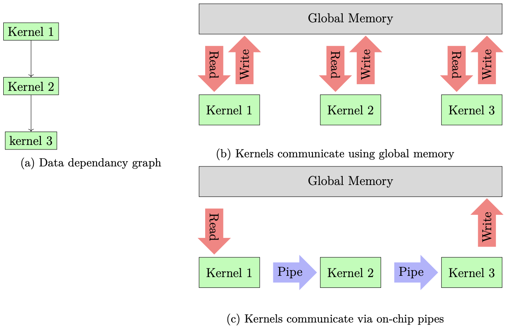
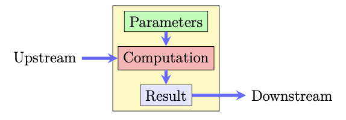
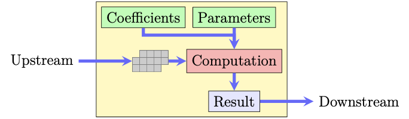
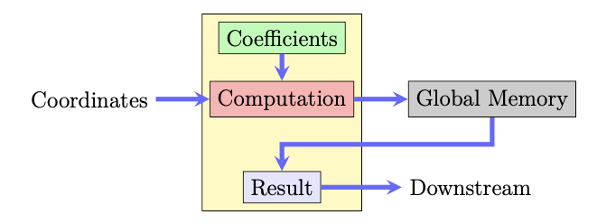

## Supported Vision Function
This repository implements the following list of vision functions (taken from OpenVX Spec) as streaming components that can be connected to create data flow architectures on the FPGA. This categorization is based on common data access patterns of kernels.



| Category        | Formal Definition | Vision Functions  |
| ------------- |:-------------|:-----|
| Pixel-wise      | out(x, y) = f(in(x, y)) | absolute difference, accumulate, accumulate squared, accumulate weighted, addition/subtraction, bitwise operations, channel combine, channel extract, color convert, convert bit depth, magnitude, phase, pixel-wise multiplication, threshold, min, max |
| Fixed-rate Stencil      | $out(x, y)=\sum_{i=-k}^{i=k} \sum_{j=-k}^{j=k} f(in(x+i, y+j))$      |   Box filter, Sobel filter, non-maxima suppression, custom convolution, erode, dilate, Gaussian blur, nonlinear filter, integral image, Median filter |
| Multi-rate Stencil |$out(x,y)=\sum_{i=-k}^{i=k} \sum_{j=-k}^{j=k} f(in(Nx+i, Ny+j))$     |    down-sample, scale image  |
| Statistical | $out=\sum_{i=0}^{i=Width} \sum_{j=0}^{j=Height} f(in(i, j))$     |    histogram, mean, standard deviation, Min,max location |
| Table lookup | table[in(x,y)]      |    table lookup |
|  ||

Streaming kernels are connected via channels (FIFO buffers). This will avoid using FPGA global memroy for communication and will improve power and throughput. The following picture shows a simple algorithm graph with two different scenarios for communication (using global memory vs using channels). Note that the input and ouptut nodes still need to access FPGA global memory. Note that it is possible to avoid using FPGA global memory altogether and stram data in/out of FPGA via PCIe communication.



## Streaming Vision Function Implementastion
For each of the above-mentioend categories, we have developed a parametric OpenCL kernel that can be customized to implement different vision function within the category. 

| Category        | Architectural Template |
| ------------- |:-------------|
| Pixel-wise | | 
| Stencil | | 
| Statistical |  | 
| Geometric |  |

## Programming Interface

Each category of vision funcitons can be instanitated anc configure using C-style macors. Those macros take variety of parameters and will be realized as a OpenCL kernel that operates on streams of data. Parameters include:
1. Name of the kernel (it must be unique)
2. Unrolling factor: Specifies the amount of pixel-level parallelism within the function. This value indicate the number of input items that will be processed by the funciton at every cycle.
3. Input type (must be a valid OpenCL type such as char, int, float, etc.)
4. Ouput type (again msut ba a valid OpenCL type)
5. Vision function to be applied on the input sequence (see fpga/include)
6. Input and ouptut channels

```c
#define PIXELWISE_IO(NAME, UNROLL, IN_TYPE, OUT_TYPE, FUNC, IN_CH, OUT_CH) __kernel \
void NAME(uint items) {                                                             \
  TYPE(out_data, OUT_TYPE, UNROLL);                                                 \
  TYPE(in_data, IN_TYPE, UNROLL);                                                   \
  uint counter = 0;                                                                 \
  while (counter < items) {                                                         \
    in_data = read_channel_intel(IN_CH);                                            \
    CAT2(FUNC,UNROLL)(in_data, &out_data);                                          \
    write_channel_intel(OUT_CH, out_data);                                          \
    counter += (UNROLL);                                                            \
  }                                                                                 \
}
```

An example of this class would be a simple threshold function.
```c
PIXELWISE_IO(kernel_threshold, SIMD_SIZE, short, uchar, threshold, ch_supp, ch_out)
```

```c
#define PIXELWISE_IIO(NAME, UNROLL, IN_TYPE, OUT_TYPE, FUNC, IN_CH0, IN_CH1, OUT_CH) __kernel \
void NAME(uint items) {                                                            \ 
  TYPE(in_data0, IN_TYPE, UNROLL);                                                 \
  TYPE(in_data1, IN_TYPE, UNROLL);                                                 \
  TYPE(out_data, OUT_TYPE, UNROLL);                                                \
  uint counter = 0;                                                                \
  while (counter < items) {                                                        \
    in_data0 = read_channel_intel(IN_CH0);                                         \
    in_data1 = read_channel_intel(IN_CH1);                                         \
    CAT2(FUNC,UNROLL)(in_data0, in_data1, &out_data);                              \
    write_channel_intel(OUT_CH, out_data);                                         \
    counter += (UNROLL);                                                           \
  }                                                                                \
}
```

An example of this type would be the magnitude kernel.
```c
PIXELWISE_IIO(kernel_magnitude, 8, short, short, magnitude_l2, ch_sobel_x, ch_sobel_y, ch_mag)
```

Special kernels (``SRC_KERNEL`` and ``SINK_KERNEL``) provides access to host-FPGA communication pipe. Now we can define a minimal working example that thresholds an input image. Note that in this pipeline ``SRC_KERNEL`` and ``SINK_KERNEL`` operate on ``unsigned char`` pixels, hence they expect input/output sequence to be a grayscale images. Other alternative would be to use ```unsigned int``` as pixel type that corresponds to RGBX color format.

```cpp
#define SIMD_SZ 8
SRC_KERNEL(uchar, SIMD_SIZE, ch_source)
CHANNEL(ch_in, uchar, SIMD_SZ, 0)
CHANNEL(ch_thresh, uchar, SIMD_SZ, 0)
CHANNEL(ch_out, uchar, SIMD_SZ, 0)
PIXELWISE_IO(SIDM_SZ, threshold, p_in, p_thresh)
STENCIL(SIDM_SZ, filter, p_thresh, p_out)
SINK_KERNEL(uchar, SIMD_SIZE, ch_filter)
```

### Build Sample Applications
To build the sample applications do:

```bash
cd fpga
mkdir build && cd build
cmake ..
make [sample-target]
```

Where sample is the name of the sample and ouput is the compilation target and could be one of the following:
1. emul: Compiled for emulation target. Host program should be run with ```-e``` flag.
2. rtl: Compiles to RTL.
3. fpga: Full FPGA compilation.


